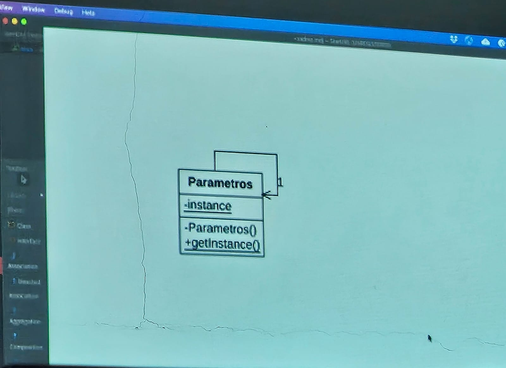

# Padrão de Projeto: Singleton

**Singleton** é um padrão de design de criação que permite garantir que uma classe tenha apenas uma instância, ao mesmo tempo em que fornece um ponto de acesso global a esta instância.


#### Diagrama de Classe


## O Problema

O padrão Singleton resolve dois problemas ao mesmo tempo, violando o princípio da responsabilidade única:

1. **Certifique-se de que uma classe tenha apenas uma única instância.**

    - Por que alguém quer controlar quantas instâncias uma classe tem? O motivo mais comum para isso é controlar o acesso a algum recurso compartilhado, por exemplo, um banco de dados ou um arquivo.

    - Veja como funciona: imagine que você criou um objeto, mas depois de um tempo decidiu criar um novo. Em vez de receber um objeto novo, você terá o que já criou.

    - Observe que esse comportamento é impossível de implementar com um construtor regular, já que uma chamada de construtor deve sempre retornar um novo objeto por design.


2. **Proporcionar um ponto de acesso global a essa instância.**

    - Lembre-se daquelas variáveis globais que você (tudo bem, eu) usou para armazenar alguns objetos essenciais? Embora sejam muito úteis, eles também são muito inseguros, já que qualquer código pode potencialmente substituir o conteúdo dessas variáveis e travar o aplicativo.

    - Assim como uma variável global, o padrão Singleton permite acessar algum objeto de qualquer lugar do programa. No entanto, também protege essa instância de ser sobrescrito por outro código.

    - Há um outro lado desse problema: você não quer que o código que resolve o problema 1 seja espalhado por todo o seu programa. É muito melhor tê-lo dentro de uma classe, especialmente se o resto do seu código já depende dele.

Hoje em dia, o padrão Singleton tornou-se tão popular que as pessoas podem chamar algo de um singleton, mesmo que resolva apenas um dos problemas listados.

## A Solução

Todas as implementações do Singleton têm duas etapas em comum:

- Torne o construtor padrão privado, para evitar que outros objetos usem o newoperador com a classe Singleton.
- Crie um método de criação estática que atua como um construtor. Sob o capô, esse método chama o construtor privado para criar um objeto e o salva em um campo estático. Todas as chamadas seguintes a este método retornam o objeto em cache.

Se o seu código tiver acesso à classe Singleton, ele poderá ligar para o método estático do Singleton. Então, sempre que esse método é chamado, o mesmo objeto é sempre retornado.

## Analogia do Mundo Real

O governo é um excelente exemplo do padrão Singleton. Um país só pode ter um governo oficial. Independentemente das identidades pessoais dos indivíduos que formam os governos, o título, “O Governo de X”, é um ponto de acesso global que identifica o grupo de pessoas responsáveis.

## A Estrutura


O que é **Singleton** Classe declara o método estático getInstance que retorna a mesma instância de sua própria classe.

O construtor de Singleton deve ser escondido do código do cliente. A Chamar o getInstance O método deve ser a única maneira de obter o objeto Singleton.

## A aplicabilidade

**Use o padrão Singleton quando uma classe em seu programa deve ter apenas uma única instância disponível para todos os clientes; por exemplo, um único objeto de banco de dados compartilhado por diferentes partes do programa.**

O padrão Singleton desativa todos os outros meios de criar objetos de uma classe, exceto para o método de criação especial. Este método cria um novo objeto ou retorna um existente se ele já tiver sido criado.

**Use o padrão Singleton quando precisar de um controle mais rigoroso sobre as variáveis globais.**

Ao contrário das variáveis globais, o padrão Singleton garante que há apenas um caso de uma classe. Nada, exceto para a própria classe Singleton, pode substituir a instância em cache.

Observe que você sempre pode ajustar essa limitação e permitir a criação de qualquer número de instâncias de Singleton. A única peça de código que precisa mudar é o corpo do `getInstance` método.

## Como implementar

1. Adicione um campo fixo privado à classe para armazenar a instância singleton.

2. Declare um método de criação estática pública para obter a instância singleton.

3. Implemente “inicialização preguiçosa” dentro do método estático. Ele deve criar um novo objeto em sua primeira chamada e colocá-lo no campo estático. O método deve sempre retornar essa instância em todas as chamadas subsequentes.

4. Faça o construtor da classe privado. O método estático da classe ainda será capaz de chamar o construtor, mas não os outros objetos.

5. Revise o código do cliente e substitua todas as chamadas diretas para o construtor do singleton por chamadas para o método de criação estática.

## Prós
- Você pode ter certeza de que uma classe tem apenas uma única instância.
- Você ganha um ponto de acesso global a essa instância.
- O objeto singleton é inicializado somente quando solicitado pela primeira vez.

## Contras
- Viola o Princípio de responsabilidade única- A . (í a questão: es. , , , íntepe O padrão resolve dois problemas na época.
- O padrão Singleton pode mascarar um design ruim, por exemplo, quando os componentes do programa sabem muito uns sobre os outros.
- O padrão requer tratamento especial em um ambiente multithreaded para que vários fios não criem um objeto singleton várias vezes.
- Pode ser difícil testar o código do cliente do Singleton porque muitas estruturas de teste dependem da herança ao produzir objetos simulados. Uma vez que o construtor da classe singleton é privado e os métodos estáticos predominantes são impossíveis na maioria das línguas, você precisará pensar em uma maneira criativa de zombar do singleton. Ou simplesmente não escreva os testes. Ou não use o padrão Singleton.

## Código Java

```java
// Parametros.java
package materiais.padroescriacao.singleton;

public class Parametros {

    private Parametros() {};
    private static Parametros instance = new Parametros();
    public static Parametros getInstance() {
        return instance;
    }

    private String nomeEscola;
    private String usuarioLogado;

    public String getNomeEscola() {
        return nomeEscola;
    }

    public void setNomeEscola(String nomeEscola) {
        this.nomeEscola = nomeEscola;
    }

    public String getUsuarioLogado() {
        return usuarioLogado;
    }

    public void setUsuarioLogado(String usuarioLogado) {
        this.usuarioLogado = usuarioLogado;
    }
}

```

```java
// ParametrosTest.java
package materiais.padroescriacao.singleton;

import org.junit.jupiter.api.Test;

import static org.junit.jupiter.api.Assertions.*;

class ParametrosTest {

    @Test
    public void deveRetornarNomeEscola() {
        Parametros.getInstance().setNomeEscola("Escola 1");
        assertEquals("Escola 1", Parametros.getInstance().getNomeEscola());
    }

    @Test
    public void deveRetornarUsuarioLogado() {
        Parametros.getInstance().setUsuarioLogado("Usuario 1");
        assertEquals("Usuario 1", Parametros.getInstance().getUsuarioLogado());
    }

}
```

## Aplicação Java


```java
// Logger.java
package aulas.aulaAB;

import java.io.FileWriter;
import java.io.IOException;
import java.io.PrintWriter;
import java.time.LocalDateTime;

public class Logger {
    private static Logger instancia;
    private PrintWriter escritor;

    private Logger() {
        try {
            FileWriter fw = new FileWriter("aplicacao.log", true);
            escritor = new PrintWriter(fw, true);
        } catch (IOException e) {
            e.printStackTrace();
        }
    }

    public static Logger getInstancia() {
        if (instancia == null) {
            instancia = new Logger();
        }
        return instancia;
    }

    public void log(String mensagem) {
        String dataHora = LocalDateTime.now().toString();
        escritor.println("[" + dataHora + "] " + mensagem);
    }
}
```

```java
// LoggerTest.java
package aulas.aulaAB;

import org.junit.jupiter.api.*;
import java.io.*;
import java.lang.reflect.Field;

import static org.junit.jupiter.api.Assertions.*;

class LoggerTest {

    private static final String LOG_FILE = "aplicacao.log";

    @Test
    void testInstanciaNaoEhNula() {
        Logger logger = Logger.getInstancia();
        assertNotNull(logger, "A instância do logger não deveria ser nula.");
    }

    @Test
    void testInstanciaEhSempreAMesma() {
        Logger logger1 = Logger.getInstancia();
        Logger logger2 = Logger.getInstancia();
        assertSame(logger1, logger2, "As duas instâncias devem ser a mesma ().");
    }

    @Test
    void testLogEscreveNoArquivo() throws IOException {
        Logger logger = Logger.getInstancia();
        String mensagem = "Teste de log unitário";

        logger.log(mensagem);

        BufferedReader reader = new BufferedReader(new FileReader(LOG_FILE));
        String linha = reader.readLine();
        reader.close();

        assertNotNull(linha, "A linha do log não deveria ser nula.");
        assertTrue(linha.contains(mensagem), "A linha do log deveria conter a mensagem de teste.");
    }
}
```
