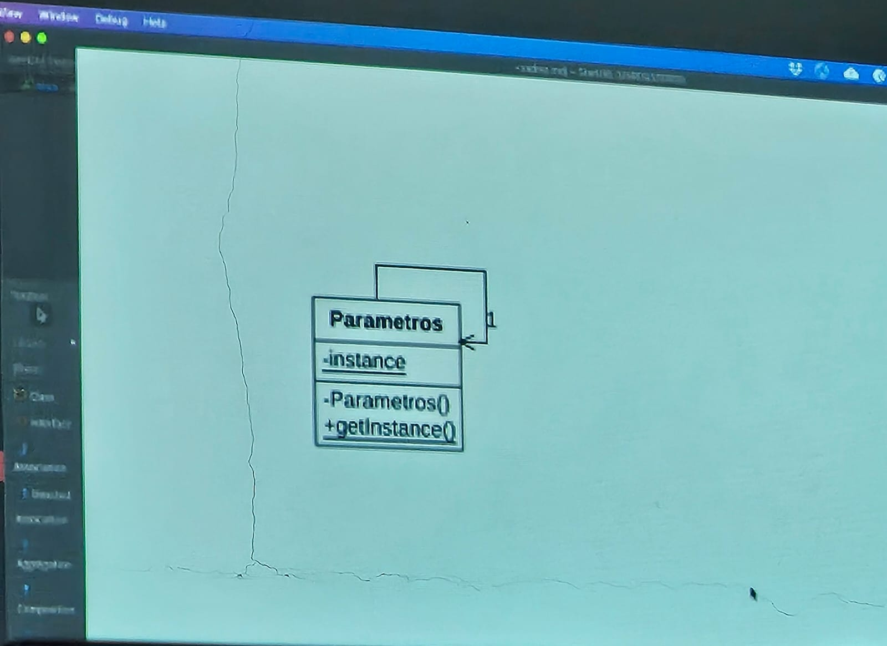
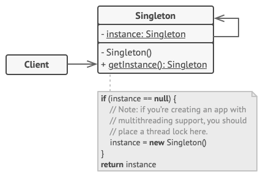
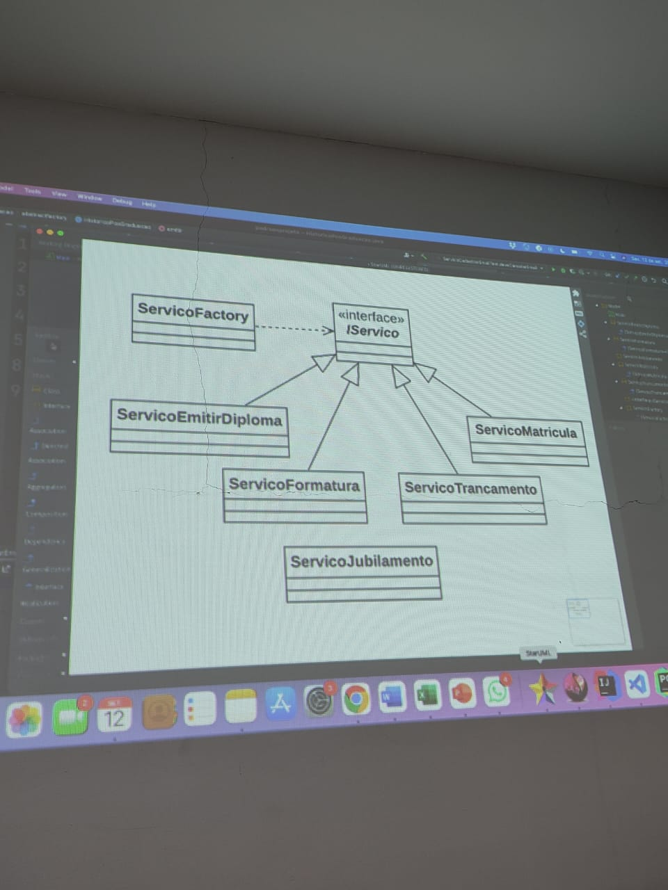
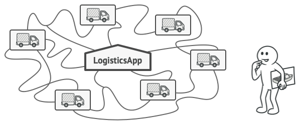
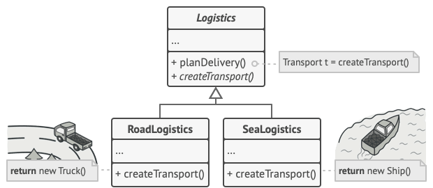
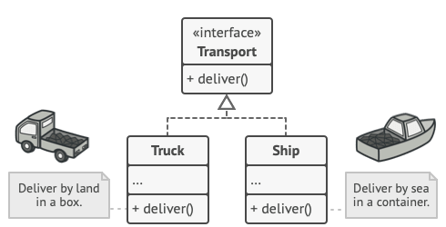
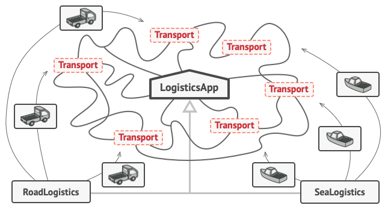
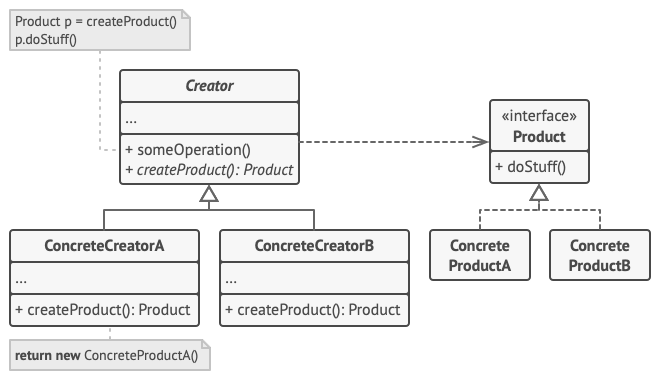

# Revisão para P1 de Arquitetura e Projeto de Software da Universidade de Vassouras

Os padrões de projeto serão:
1. Singleton
2. Factory Method
3. Abstract Factory
4. Brige
5. Decorator

# 1. Singleton

**Singleton** é um padrão de design de criação que permite garantir que uma classe tenha apenas uma instância, ao mesmo tempo em que fornece um ponto de acesso global a esta instância.


#### Diagrama de Classe


## O Problema

O padrão Singleton resolve dois problemas ao mesmo tempo, violando o princípio da responsabilidade única:

1. **Certifique-se de que uma classe tenha apenas uma única instância.**

    - Por que alguém quer controlar quantas instâncias uma classe tem? O motivo mais comum para isso é controlar o acesso a algum recurso compartilhado, por exemplo, um banco de dados ou um arquivo.

   - Veja como funciona: imagine que você criou um objeto, mas depois de um tempo decidiu criar um novo. Em vez de receber um objeto novo, você terá o que já criou. 

   - Observe que esse comportamento é impossível de implementar com um construtor regular, já que uma chamada de construtor deve sempre retornar um novo objeto por design.


2. **Proporcionar um ponto de acesso global a essa instância.**

   - Lembre-se daquelas variáveis globais que você (tudo bem, eu) usou para armazenar alguns objetos essenciais? Embora sejam muito úteis, eles também são muito inseguros, já que qualquer código pode potencialmente substituir o conteúdo dessas variáveis e travar o aplicativo.

   - Assim como uma variável global, o padrão Singleton permite acessar algum objeto de qualquer lugar do programa. No entanto, também protege essa instância de ser sobrescrito por outro código.

   - Há um outro lado desse problema: você não quer que o código que resolve o problema 1 seja espalhado por todo o seu programa. É muito melhor tê-lo dentro de uma classe, especialmente se o resto do seu código já depende dele.

Hoje em dia, o padrão Singleton tornou-se tão popular que as pessoas podem chamar algo de um singleton, mesmo que resolva apenas um dos problemas listados.

## A Solução

Todas as implementações do Singleton têm duas etapas em comum:

- Torne o construtor padrão privado, para evitar que outros objetos usem o newoperador com a classe Singleton.
- Crie um método de criação estática que atua como um construtor. Sob o capô, esse método chama o construtor privado para criar um objeto e o salva em um campo estático. Todas as chamadas seguintes a este método retornam o objeto em cache.

Se o seu código tiver acesso à classe Singleton, ele poderá ligar para o método estático do Singleton. Então, sempre que esse método é chamado, o mesmo objeto é sempre retornado.

## Analogia do Mundo Real

O governo é um excelente exemplo do padrão Singleton. Um país só pode ter um governo oficial. Independentemente das identidades pessoais dos indivíduos que formam os governos, o título, “O Governo de X”, é um ponto de acesso global que identifica o grupo de pessoas responsáveis.

## A Estrutura



O que é **Singleton** Classe declara o método estático getInstance que retorna a mesma instância de sua própria classe.

O construtor de Singleton deve ser escondido do código do cliente. A Chamar o getInstance O método deve ser a única maneira de obter o objeto Singleton.

## A aplicabilidade

**Use o padrão Singleton quando uma classe em seu programa deve ter apenas uma única instância disponível para todos os clientes; por exemplo, um único objeto de banco de dados compartilhado por diferentes partes do programa.**

O padrão Singleton desativa todos os outros meios de criar objetos de uma classe, exceto para o método de criação especial. Este método cria um novo objeto ou retorna um existente se ele já tiver sido criado.

**Use o padrão Singleton quando precisar de um controle mais rigoroso sobre as variáveis globais.**

Ao contrário das variáveis globais, o padrão Singleton garante que há apenas um caso de uma classe. Nada, exceto para a própria classe Singleton, pode substituir a instância em cache.

Observe que você sempre pode ajustar essa limitação e permitir a criação de qualquer número de instâncias de Singleton. A única peça de código que precisa mudar é o corpo do `getInstance` método.

## Como implementar

1. Adicione um campo fixo privado à classe para armazenar a instância singleton.

2. Declare um método de criação estática pública para obter a instância singleton.

3. Implemente “inicialização preguiçosa” dentro do método estático. Ele deve criar um novo objeto em sua primeira chamada e colocá-lo no campo estático. O método deve sempre retornar essa instância em todas as chamadas subsequentes.

4. Faça o construtor da classe privado. O método estático da classe ainda será capaz de chamar o construtor, mas não os outros objetos.

5. Revise o código do cliente e substitua todas as chamadas diretas para o construtor do singleton por chamadas para o método de criação estática.

## Prós
- Você pode ter certeza de que uma classe tem apenas uma única instância.
- Você ganha um ponto de acesso global a essa instância.
- O objeto singleton é inicializado somente quando solicitado pela primeira vez.

## Contras
- Viola o Princípio de responsabilidade única- A . (í a questão: es. , , , íntepe O padrão resolve dois problemas na época.
- O padrão Singleton pode mascarar um design ruim, por exemplo, quando os componentes do programa sabem muito uns sobre os outros.
- O padrão requer tratamento especial em um ambiente multithreaded para que vários fios não criem um objeto singleton várias vezes.
- Pode ser difícil testar o código do cliente do Singleton porque muitas estruturas de teste dependem da herança ao produzir objetos simulados. Uma vez que o construtor da classe singleton é privado e os métodos estáticos predominantes são impossíveis na maioria das línguas, você precisará pensar em uma maneira criativa de zombar do singleton. Ou simplesmente não escreva os testes. Ou não use o padrão Singleton.

## Código Java

```java
// Parametros.java
package materiais.padroescriacao.singleton;

public class Parametros {

    private Parametros() {};
    private static Parametros instance = new Parametros();
    public static Parametros getInstance() {
        return instance;
    }

    private String nomeEscola;
    private String usuarioLogado;

    public String getNomeEscola() {
        return nomeEscola;
    }

    public void setNomeEscola(String nomeEscola) {
        this.nomeEscola = nomeEscola;
    }

    public String getUsuarioLogado() {
        return usuarioLogado;
    }

    public void setUsuarioLogado(String usuarioLogado) {
        this.usuarioLogado = usuarioLogado;
    }
}

```

```java
// ParametrosTest.java
package materiais.padroescriacao.singleton;

import org.junit.jupiter.api.Test;

import static org.junit.jupiter.api.Assertions.*;

class ParametrosTest {

    @Test
    public void deveRetornarNomeEscola() {
        Parametros.getInstance().setNomeEscola("Escola 1");
        assertEquals("Escola 1", Parametros.getInstance().getNomeEscola());
    }

    @Test
    public void deveRetornarUsuarioLogado() {
        Parametros.getInstance().setUsuarioLogado("Usuario 1");
        assertEquals("Usuario 1", Parametros.getInstance().getUsuarioLogado());
    }

}
```

## Aplicação Java


```java
// Logger.java
package aulas.aulaAB;

import java.io.FileWriter;
import java.io.IOException;
import java.io.PrintWriter;
import java.time.LocalDateTime;

public class Logger {
    private static Logger instancia;
    private PrintWriter escritor;

    private Logger() {
        try {
            FileWriter fw = new FileWriter("aplicacao.log", true);
            escritor = new PrintWriter(fw, true);
        } catch (IOException e) {
            e.printStackTrace();
        }
    }

    public static Logger getInstancia() {
        if (instancia == null) {
            instancia = new Logger();
        }
        return instancia;
    }

    public void log(String mensagem) {
        String dataHora = LocalDateTime.now().toString();
        escritor.println("[" + dataHora + "] " + mensagem);
    }
}
```

```java
// LoggerTest.java
package aulas.aulaAB;

import org.junit.jupiter.api.*;
import java.io.*;
import java.lang.reflect.Field;

import static org.junit.jupiter.api.Assertions.*;

class LoggerTest {

    private static final String LOG_FILE = "aplicacao.log";

    @Test
    void testInstanciaNaoEhNula() {
        Logger logger = Logger.getInstancia();
        assertNotNull(logger, "A instância do logger não deveria ser nula.");
    }

    @Test
    void testInstanciaEhSempreAMesma() {
        Logger logger1 = Logger.getInstancia();
        Logger logger2 = Logger.getInstancia();
        assertSame(logger1, logger2, "As duas instâncias devem ser a mesma ().");
    }

    @Test
    void testLogEscreveNoArquivo() throws IOException {
        Logger logger = Logger.getInstancia();
        String mensagem = "Teste de log unitário";

        logger.log(mensagem);

        BufferedReader reader = new BufferedReader(new FileReader(LOG_FILE));
        String linha = reader.readLine();
        reader.close();

        assertNotNull(linha, "A linha do log não deveria ser nula.");
        assertTrue(linha.contains(mensagem), "A linha do log deveria conter a mensagem de teste.");
    }
}
```

# 2. Factory Method

**Factory Method** é um padrão de design criacional que fornece uma interface para criar objetos em uma superclasse, mas permite que subclasses alterem o tipo de objetos que serão criados.


#### Diagrama de Classe


## O Problema
Imagine que você está criando um aplicativo de gerenciamento de logística. A primeira versão do seu aplicativo só pode lidar com o transporte por caminhões, então a maior parte do seu código vive dentro do `Truck` de classe.

Depois de um tempo, seu aplicativo se torna bastante popular. Todos os dias você recebe dezenas de pedidos de empresas de transporte marítimo para incorporar a logística do mar no aplicativo.


Adicionar uma nova classe ao programa não é tão simples se o resto do código já estiver acoplado às classes existentes.

Boas notícias, não é? Mas e o código? Atualmente, a maior parte do seu código é acoplado ao `Truck` de classe. Aparecendo `Ships` no aplicativo exigiria fazer alterações em toda a base de código. Além disso, se mais tarde você decidir adicionar outro tipo de transporte ao aplicativo, você provavelmente precisará fazer todas essas alterações novamente.

Como resultado, você vai acabar com um código bastante desagradável, cheio de condicionais que alteram o comportamento do aplicativo dependendo da classe de objetos de transporte.

## A Solução
O padrão do Método de Fábrica sugere que você substitua as chamadas diretas de construção de objetos (usando o `new` operador) com chamadas para um especial fábrica método. Não se preocupe: os objetos ainda são criados através do `new` operador, mas está sendo chamado de dentro do método de fábrica. Objetos retornados por um método de fábrica são muitas vezes referidos como Os produtos.


Subclasses podem alterar a classe de objetos que estão sendo retornados pelo método de fábrica.

A primeira vista, essa mudança pode parecer inútil: acabamos de mover a chamada do construtor de uma parte do programa para outra. No entanto, considere o seguinte: agora você pode substituir o método de fábrica em uma subclasse e alterar a classe de produtos que estão sendo criados pelo método.

No entanto, há uma pequena limitação: as subclasses podem retornar diferentes tipos de produtos somente se esses produtos tiverem uma classe ou interface base comum. Além disso, o método de fábrica na classe base deve ter seu tipo de retorno declarado como esta interface.


Todos os produtos devem seguir a mesma interface.

Por exemplo, ambos `Truck` E a `Ship` As aulas devem implementar o `Transport` interface, que declara um método chamado `deliver`- A . (í a questão: es. , , , íntepeo. . E. . es. sobre a questão . (em, proprio Cada classe implementa este método de forma diferente: caminhões entregam carga por terra, navios entregam carga por mar. O método de fábrica no `RoadLogistics` classe retorna objetos de caminhão, enquanto o método de fábrica no `SeaLogistics` classe retorna navios.


Contanto que todas as classes de produtos implementem uma interface comum, você pode passar seus objetos para o código do cliente sem quebrá-lo.

O código que usa o método de fábrica (muitas vezes chamado de cliente O código não vê uma diferença entre os produtos reais retornados por várias subclasses. O cliente trata todos os produtos como abstratos `Transport`- A . (í a questão: es. , , , íntepeo. . O cliente sabe que todos os objetos de transporte devem ter o `deliver` método, mas exatamente como funciona não é importante para o cliente.

## A Estrutura
1. O **Produto** declara a interface, que é comum a todos os objetos que podem ser produzidos pelo criador e suas subclasses.
2. **Produtos de concreto** são diferentes implementações da interface do produto.
3. A classe **Criador** declara o método de fábrica que retorna novos objetos de produto. É importante que o tipo de retorno desse método corresponda à interface do produto.
Você pode declarar o método de fábrica como `abstract` forçar todas as subclasses a implementar suas próprias versões do método. Como alternativa, o método de fábrica base pode retornar algum tipo de produto padrão.
Note-se, apesar do seu nome, a criação de produtos não é responsabilidade principal do criador. Normalmente, a classe criadora já possui alguma lógica de negócio principal relacionada aos produtos. O método de fábrica ajuda a dissociar essa lógica das classes de produtos de concreto. Aqui está uma analogia: uma grande empresa de desenvolvimento de software pode ter um departamento de treinamento para programadores. No entanto, a principal função da empresa como um todo ainda é escrever código, não produzir programadores.
4. **Os criadores de concreto** substituem o método da fábrica de base para que ele retorne um tipo diferente de produto.
Observe que o método de fábrica não precisa criar novas instâncias o tempo todo. Ele também pode retornar objetos existentes de um cache, um pool de objetos ou outra fonte



## A aplicabilidade
**Use o método de fábrica quando você não sabe de antemão os tipos exatos e dependências dos objetos com os quais seu código deve funcionar.**

O método de fábrica separa o código de construção do produto do código que realmente usa o produto. Portanto, é mais fácil estender o código de construção do produto independentemente do resto do código.

Por exemplo, para adicionar um novo tipo de produto ao aplicativo, você só precisará criar uma nova subclasse de criador e substituir o método de fábrica nele.

**Use o Método de Fábrica quando quiser fornecer aos usuários de sua biblioteca ou estrutura uma maneira de estender seus componentes internos.**

A herança é provavelmente a maneira mais fácil de estender o comportamento padrão de uma biblioteca ou estrutura. Mas como a estrutura reconheceria que sua subclasse deveria ser usada em vez de um componente padrão?

A solução é reduzir o código que constrói componentes em toda a estrutura em um único método de fábrica e deixar qualquer um substituir esse método, além de estender o próprio componente.

Vamos ver como isso iria funcionar. Imagine que você escreve um aplicativo usando uma estrutura de interface de usuário de código aberto. Seu aplicativo deve ter botões redondos, mas o framework só fornece os quadrados. Você estende o padrão Button classe com um glorioso RoundButton Uma subclasse. Mas agora você precisa dizer o principal UIFramework classe para usar o novo botão subclasse em vez de um padrão.

Para conseguir isso, você cria uma subclasse UIWithRoundButtons de uma classe de base e sobressair createButton método. Enquanto este método retorna Button objetos na classe base, você faz sua subclass retornar RoundButton objetos. Agora use o UIWithRoundButtons classe em vez de UIFramework- A . (í a questão: es. , , E é sobre isso!

**Use o Método de Fábrica quando quiser economizar recursos do sistema reutilizando objetos existentes em vez de reconstruí-los de cada vez.**

Muitas vezes, você experimenta essa necessidade ao lidar com objetos grandes e intensivos em recursos, como conexões de banco de dados, sistemas de arquivos e recursos de rede.

Vamos pensar sobre o que precisa ser feito para reutilizar um objeto existente:

1. Primeiro, você precisa criar algum armazenamento para acompanhar todos os objetos criados.
2. Quando alguém solicita um objeto, o programa deve procurar um objeto livre dentro desse pool.
3. ... e depois devolvê-lo ao código do cliente.
4. Se não houver objetos livres, o programa deve criar um novo (e adicioná-lo ao pool).

Isso é muito código! E tudo deve ser colocado em um único lugar para que você não poluir o programa com código duplicado.

Provavelmente o lugar mais óbvio e conveniente onde esse código poderia ser colocado é o construtor da classe cujos objetos estamos tentando reutilizar. No entanto, um construtor deve sempre retornar novos objetos por definição. Não pode retornar instâncias existentes.

Portanto, você precisa ter um método regular capaz de criar novos objetos, bem como reutilizar os existentes. Isso soa muito como um método de fábrica.


## Como implementar

1. Faça todos os produtos seguirem a mesma interface. Esta interface deve declarar métodos que fazem sentido em cada produto.

2. Adicione um método de fábrica vazio dentro da classe criadora. O tipo de retorno do método deve corresponder à interface comum do produto.

3. No código do criador encontrar todas as referências a construtores de produtos. Um por um, substitua-os por chamadas para o método de fábrica, enquanto extrai o código de criação do produto no método de fábrica.

4. Você pode precisar adicionar um parâmetro temporário ao método de fábrica para controlar o tipo de produto devolvido.

5. Neste ponto, o código do método de fábrica pode parecer muito feio. Pode ter um grande switch declaração que escolhe qual classe de produto para instanciar. Mas não se preocupe, vamos consertá-lo em breve.

6. Agora, crie um conjunto de subclasses de criadores para cada tipo de produto listado no método de fábrica. Substitua o método da fábrica nas subclasses e extraia os bits apropriados do código de construção do método base.

7. Se houver muitos tipos de produtos e não faz sentido criar subclasses para todos eles, você pode reutilizar o parâmetro de controle da classe base em subclasses.

8. Por exemplo, imagine que você tem a seguinte hierarquia de classes: a base Mail classe com um par de subclasses: AirMail E a GroundMail; o Transport As aulas são Plane,, , - Truck E a Train- A . (í Enquanto o AirMail Usos de classe apenas Plane os objetos, GroundMail Pode trabalhar com ambos os Truck E a Train objetos. Você pode criar uma nova subclasse (digamos TrainMail) para lidar com os dois casos, mas há outra opção. O código do cliente pode passar um argumento para o método de fábrica do GroundMail classe para controlar qual produto deseja receber.

9. Se, depois de todas as extrações, o método da fábrica de base se tornar vazio, você pode torná-lo abstrato. Se houver algo sobrando, você pode torná-lo um comportamento padrão do método.


## Prós
- Você evita acoplamento apertado entre o criador e os produtos de concreto.

- Princípio de responsabilidade única- A . (í a questão: es. , , , íntepeo. . E. . es. sobre a questão . (em, proprio Você pode mover o código de criação do produto para um só lugar no programa, tornando o código mais fácil de suportar.

- Princípio aberto/cerebido- A . (í a questão: es. , , , íntepeo. . E. . es. sobre Você pode introduzir novos tipos de produtos no programa sem quebrar o código do cliente existente.

## Contras
- O código pode se tornar mais complicado, pois você precisa introduzir muitas novas subclasses para implementar o padrão. O melhor cenário é quando você está introduzindo o padrão em uma hierarquia existente de classes de criadores.

## Código Java

```java
// ServicoFactory.java
package materiais.padroescriacao.factorymethod;

public class ServicoFactory {

   public static IServico obterServico(String servico) {
      Class classe = null;
      Object objeto = null;
      try {
         classe = Class.forName("padroescriacao.factorymethod.Servico" + servico);
         objeto = classe.newInstance();
      } catch (Exception ex) {
         throw new IllegalArgumentException("Serviço inexistente");
      }
      if (!(objeto instanceof IServico)) {
         throw new IllegalArgumentException("Serviço inválido");
      }
      return (IServico) objeto;
   }
}
```

```java
// IServico.java
package materiais.padroescriacao.factorymethod;

public interface IServico {
   String executar();
   String cancelar();
}
```

```java
// ServicoMatricula.java
package materiais.padroescriacao.factorymethod;

public class ServicoMatricula implements IServico {

   public String executar() {
      return "Matrícula efetivada";
   }

   public String cancelar() {
      return "Matrícula cancelada";
   }
}
```

```java
// ServicoTrancamento.java
package materiais.padroescriacao.factorymethod;

public class ServicoTrancamento implements IServico {

   public String executar() {
      return "Trancamento efetivado";
   }

   public String cancelar() {
      return "Trancamento cancelado";
   }
}
```

```java
// ServicoJubilamento.java
package materiais.padroescriacao.factorymethod;

public class ServicoJubilamento {

   public String executar() {
      return "Jubilamento efetivado";
   }

   public String cancelar() {
      return "Jubilamento cancelado";
   }
}
```

```java
// ServicoFormatura.java
package materiais.padroescriacao.factorymethod;

public class ServicoFormatura implements IServico {

   public String executar() {
      return "Formatura efetivada";
   }

   public String cancelar() {
      return "Formatura cancelada";
   }
}
```

```java
// ServicoFactoryTest.java
package materiais.padroescriacao.factorymethod;

import org.junit.jupiter.api.Test;

import static org.junit.jupiter.api.Assertions.*;

class ServicoFactoryTest {

   @Test
   void deveRetornarExcecaoParaServicoInexistente() {
      try {
         IServico servico = ServicoFactory.obterServico("Evasao");
         fail();
      } catch (IllegalArgumentException e) {
         assertEquals("Serviço inexistente", e.getMessage());
      }
   }

   @Test
   void deveRetornarExcecaoParaServicoInvalido() {
      try {
         IServico servico = ServicoFactory.obterServico("Jubilamento");
         fail();
      } catch (IllegalArgumentException e) {
         assertEquals("Serviço inválido", e.getMessage());
      }
   }
}
```

```java
// ServicoMatriculaTest.java
package materiais.padroescriacao.factorymethod;

import org.junit.jupiter.api.Test;

import static org.junit.jupiter.api.Assertions.*;

class ServicoMatriculaTest {

   @Test
   void deveExecutarMatricula() {
      IServico servico = ServicoFactory.obterServico("Matricula");
      assertEquals("Matrícula efetivada", servico.executar());
   }

   @Test
   void deveCancelarMatricula() {
      IServico servico = ServicoFactory.obterServico("Matricula");
      assertEquals("Matrícula cancelada", servico.cancelar());
   }

}
```

```java
// ServicoTrancamentoTest.java
package materiais.padroescriacao.factorymethod;

import org.junit.jupiter.api.Test;

import static org.junit.jupiter.api.Assertions.*;

class ServicoTrancamentoTest {

   @Test
   void deveExecutarTrancamento() {
      IServico servico = ServicoFactory.obterServico("Trancamento");
      assertEquals("Trancamento efetivado", servico.executar());
   }

   @Test
   void deveCancelarTrancamento() {
      IServico servico = ServicoFactory.obterServico("Trancamento");
      assertEquals("Trancamento cancelado", servico.cancelar());
   }

}
```

```java
// ServicoFormaturaTest.java
package materiais.padroescriacao.factorymethod;

import org.junit.jupiter.api.Test;

import static org.junit.jupiter.api.Assertions.*;

class ServicoFormaturaTest {

   @Test
   void deveExecutarFormatura() {
      IServico servico = ServicoFactory.obterServico("Formatura");
      assertEquals("Formatura efetivada", servico.executar());
   }

   @Test
   void deveCancelarFormatura() {
      IServico servico = ServicoFactory.obterServico("Formatura");
      assertEquals("Formatura cancelada", servico.cancelar());
   }

}
```

# 3. Abstract Factory